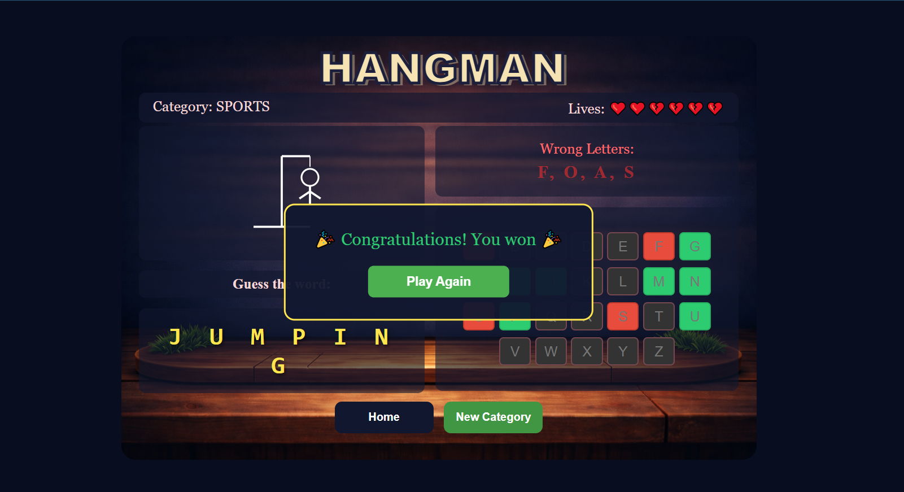

# 🎮Hangman Game 
A classic Hangman game built with **HTML, CSS, and JavaScript**. Guess the hidden word before the man is hanged

##  Live Demo
**[Play the Game Now](https://emanarafa19.github.io/hangman-game/)**

##  Features
- **4 Exciting Categories**: Animals , Countries , Sports , and Professions 
- **Interactive Visual Keyboard**: With real-time feedback
- **Animated Hangman Drawing**: SVG-based with progressive reveal
- **Life System**: 6 lives represented by hearts 
- **Smart Game Logic**: Tracks correct/wrong guesses automatically
- **Responsive Design**: Works on desktop and mobile devices
- **Category Persistence**: Remembers your last selected category

## 🎮 How to Play
1. **Start Game**: Click "Start Game" from the home page
2. **Choose Category**: Select your favorite category from 4 options
3. **Guess Letters**: Click letters on the virtual keyboard
4. **Win**: Guess all letters before the hangman is complete 
5. **Lose**: Make 6 wrong guesses and the hangman is completed 

## 📁Project Structure
hangman-game/
├── index.html # Home page (entry point)
├── hangman.html # Category selection
├── play.html # Main game interface
├── style.css # All styling rules
├── hangman.js # Complete game logic
├── assets/
│ ├── bg.png # Background image
│ ├── animals.png # Animal category icon
│ ├── countries.png # Countries category icon
│ ├── sports.png # Sports category icon
│ └── professions.png # Professions category icon
├── screenshots/
│ ├── home.png
│ ├── category.png
│ ├── play.png
│ ├── win.png
│ └── lose.png
└── README.md # Documentation

##  Screenshots
### Home Page

### Category Selection

### Game Play

### Win

### Lose

## 👤 Author
**Eman Rafa** - [GitHub Profile](https://github.com/emanarafa19)
